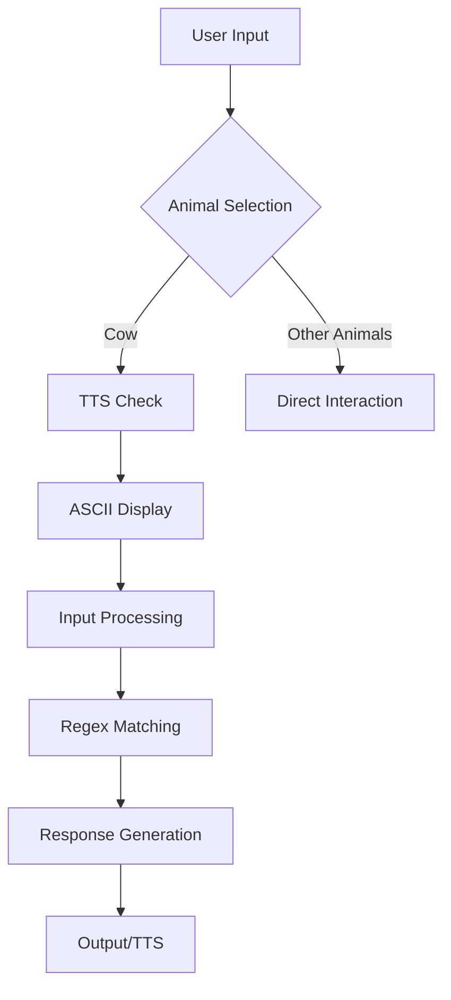

# 🐾 AnimalTalk - Interactive Animal Chat Simulator (v7.0.0)

<div align="center">
  
  
  
</div>

A charming CLI-based chatbot that lets you converse with various animals using regular expression pattern matching and ASCII art. Each animal has its unique personality and response patterns!

## 🌟 Features

- **Multi-Animal Support**: Chat with 4 different animals:
  - 🐄 Philosophical Cow 
  - 🐕 Energetic Dog
  - 😼 Sassy Cat
  - 🐠 Chill Fish
  - 🦉 Wise Owl
- **Regex-Powered Responses**: Intelligent pattern matching for dynamic conversations
- **ASCII Art Personalities**: Unique visual representation for each animal
- **Text-to-Speech**: Optional TTS support for Each Animal
- **Contextual Understanding**: 100+ predefined response patterns
- **Interactive CLI**: Simple and intuitive text-based interface

## 🚀 Installation Guide

### Prerequisites
To get started, make sure you have the following prerequisites installed:

- **Go** version 1.21+  
- **TTS Support**:
  - **Linux**: Install `espeak` using:  
    ```bash
    sudo apt-get install espeak
    ```
   - **FreeBSD**: Install `espeak` using:  
    ```bash
    pkg install espack
    ```

  - **Windows/macOS**: Follow the installation steps from the [eSpeak official website](http://espeak.sourceforge.net/).

---

### Installation Instructions by Platform

#### **Linux**  
1. Clone the repository:
   ```bash
git clone https://github.com/CalestialAshley35/animaltalk.git
cd animaltalk
go run animaltalk.go
```

- macOS: Download the binary from the [official release](https://sourceforge.net/projects/animaltalk/files/animaltalk7/download)
- Windows: Download the executable from the [official release](https://sourceforge.net/projects/animaltalk/files/animaltalk7.exe/download)
- FreeBSD: Download the Binary from [official release](https://sourceforge.net/projects/animaltalk/files/animaltalkforbsd/download)

### Mobile OS

- Android/iOS: you can use Termux for Android and iSH Shell for iOS, 
1. Clone the repository:
   ```bash
git clone https://github.com/CalestialAshley35/termux-animaltalk.git
cd termux-animaltalk
```

2. Run Installer Script:
   ```bash
bash install.sh
```

## 🕹️ Usage

1. Start the program:
   ```bash
   go run animaltalk.go
   ```
2. Choose an animal from the list
3. Begin your conversation!
4. Type `exit` at any time to quit

**Example Session:**
```text
Choose your animal (cow, dog, cat, fish): cow
Do you want Text to Speech? (y/n): n

        (__)
         (oo)
  /-------\/
 / |     ||
*  ||----||
   ^^    ^^
cow> hello
Moo! Moo! I'm Mr. Cow 🐄🐮, the barn's life of the party!
cow> 
```

## 📜 Responses List

Here are few responses:
- **Cow Responses:**  
  - "Hello" → "Moo! Moo! I'm Mr. Cow 🐄🐮, the barn's life of the party!"
  - "Dance" → "You bet! Watch me swing those hips in a moo-tastic two-step! 🕺💃"

- **Dog Responses:**  
  - "Hello" → "Woof! Woof! I’m the top dog! Bow-wow! 🐕"
  - "Bone" → "Bone! Bone! I could bury bones all day! 🦴"

- **Cat Responses:**  
  - "Hello" → "Meow! I’m the purr-fect companion. And, no, I don’t do tricks. 😼"
  - "Fish" → "Fish? YES! I WILL EAT ALL THE FISH! 🐟"

- **Fish Responses:**  
  - "Hello" → "Blub! Blub! I'm just swimming by, no biggie. 🐠"
  - "Water" → "Water? It’s my entire world, you know! 🌊"

- **Wise Owl Responses:**  
  - "Hello" → "Greetings, young one. Wisdom comes to those who seek it. 🦉"
  - "Night** → "Night is my time to shine. The moonlight and stars are my companions. 🌙"

All animal responses and conversation patterns are documented in [RESPONSES.md](RESPONSES.md). This includes:
- All possible animal responses

## 🔊 Text-to-Speech Feature

- Enabled with `y` during animal selection
- Uses `espeak` for TTS
- Adds vocal dimension to interactions
- Perfect for accessibility purposes
- if you type n The Animal will response in text rather than voice 

## 🛠️ Technical Details

### Architecture


### Pattern Matching System
- Case-insensitive regex patterns
- Word boundary detection (`\b` anchors)
- Priority-based first-match system
- Fallback to default response

## 🤝 Contributing

We welcome contributions! Please see our [CONTRIBUTING.md](CONTRIBUTING.md) for:
- Feature request guidelines
- Bug report templates
- Code style requirements
- Pull request processes

## 📄 License

MIT License - See [LICENSE](LICENSE) for details.

## 🐮 Acknowledgments

- ASCII art from various online sources
- Emoji support from Unicode Consortium
- TTS powered by eSpeak NG